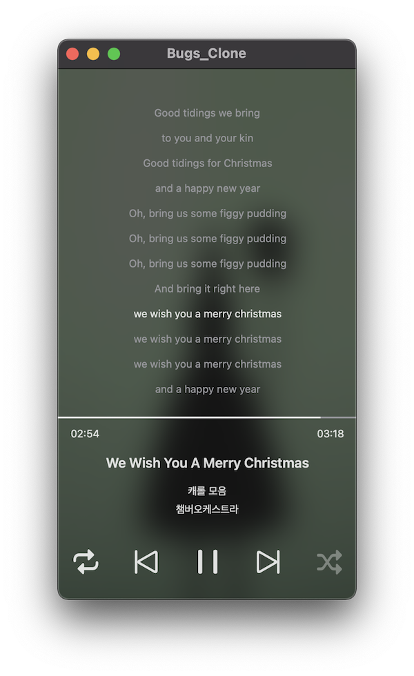

# Bugs_Clone

Bugs 클론코딩

## 스크린샷

|  |  |
| -------------------- | -------------------- |

## 프로젝트 구조

### App

#### Bugs_Clone_UIKit

UIKit으로 작성된 UI를 사용한 최종 애플리케이션을 제공한다.

#### Bugs_Clone_SwiftUI

SwiftUI로 작성된 UI를 사용한 최종 애플리케이션을 제공한다.

### UI

#### MusicPlayerUI_UIKit

UIKit으로 작성된 MusicPlayer의 UI를 제공한다.

#### MusicPlayerUI_SwiftUI

SwiftUI로 작성된 MusicPlayer의 UI를 제공한다.

### Domain

#### MusicPlayerCommon

MusicPlayer 도메인에 대한 코드를 제공한다.

ViewModel이 여기에 위치하여, UI 레이어에서 ViewModel 코드를 사용한다.

### Shared

#### Walkman

오디오 재생에 필요한 컴포넌트를 제공한다.

#### WalkmanContentsProvider

오디오 재생에 필요한 데이터를 제공한다.

#### Common

모든 곳에서 재사용할 수 있는 코드를 제공한다.

