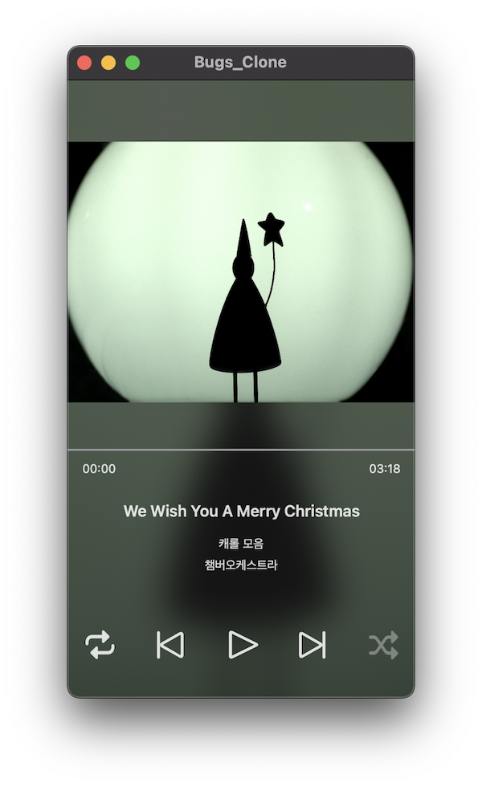

# Bugs_Clone

Bugs 클론코딩

리소스는 공개된 FLO 채용 과제 리소스를 사용함.

## 목표

- 동일한 UI를 각각 UIKit과 SwiftUI로 작성한다.
- UI를 제외한 코드는 재사용 가능하도록 한다.
- 프레임워크 수준에서 역할을 분리하여 책임이 물리적으로 분리될 수 있도록 한다.

## 스크린샷

|  |  |
| -------------------- | -------------------- |

## 프로젝트 구조

### App

#### Bugs_Clone_UIKit

UIKit의 App Delegate 라이프사이클을 사용하는 최종 애플리케이션을 제공한다.

편의상 UIKit으로 작성된 UI를 모아둔 `MusicPlayerUI_UIKit`를 사용하였다.

#### Bugs_Clone_SwiftUI

SwiftUI의 App 라이프사이클을 사용하는 최종 애플리케이션을 제공한다.

편의상 SwiftUI로 작성된 UI를 모아둔 `MusicPlayerUI_SwiftUI`를 사용하였다.

### UI

#### MusicPlayerUI_UIKit

UIKit으로 작성된 MusicPlayer 화면의 UI를 제공한다.

`UIViewController` 또는 `UIView`의 서브클래스들이 여기에 위치한다.

#### MusicPlayerUI_SwiftUI

SwiftUI로 작성된 MusicPlayer 화면의 UI를 제공한다.

`View`를 구현한 것들이 여기에 위치한다.

### Domain

#### MusicPlayerCommon

MusicPlayer 화면의 UI가 사용할 수 있는 것들(ex. ViewModel)을 제공한다.

UI 레이어에 있는 두 프레임워크가 해당 레이어에 있는 코드를 재사용할 수 있다.

### Shared

#### Walkman

오디오 재생에 필요한 컴포넌트(`AVFoundation.AVAudioPlayer` 래핑)를 제공한다.

#### WalkmanContentsProvider

오디오 재생에 필요한 데이터(ex. REST API Request 및 Response, Response Model)를 제공한다.

#### Common

모든 곳에서 재사용할 수 있는 코드(ex. Formatter, Logger와 같은 유틸성 코드)를 제공한다.

